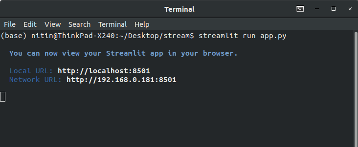
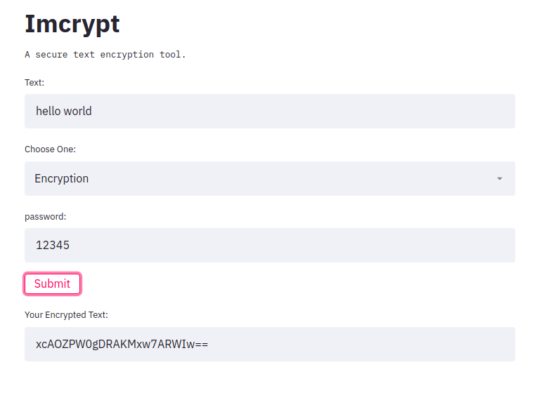
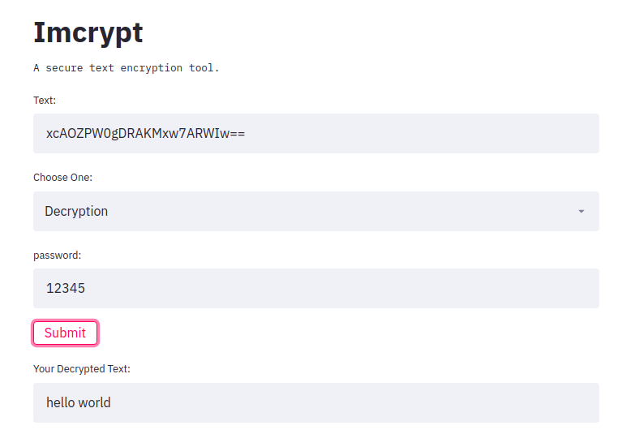

## Imcrypt-app

Here we have an seamless stunning web-app for text encryption and decryption, built using streamlit.

#### Required modules

````pyth
pip install streamlit
pip install imcrypt
````

#### How to run

just clone this repository, cd into ``imcrypt-app`` and run the below command:

````python
streamlit run app.py
````



After it go to this address  ``http://localhost:8501`` in your browser.

### Screenshots





The code is itself very short, you can see yourself.

````python
import streamlit as st
import imcrypt

st.title('Imcrypt')

st.text('A secure text encryption tool.')
text = st.text_input('Text:')
e_type = st.selectbox('Choose One:', ('Encryption', 'Decryption'))
password = st.text_input('password:')
submit = st.button('Submit')

if submit:
    #text or password should not be empty
    if not (password == '' or text==''):
        
        #if Encryption is choosen
        if e_type == 'Encryption':
            enc_text = imcrypt.encrypt(text, key=password)
            st.text_input('Your Encrypted Text:',f'{enc_text}')

        #if Decryption is choosen
        elif e_type == 'Decryption':
            try:
                enc_text = imcrypt.decrypt(text, key=password)
                st.text_input('Your Decrypted Text:',f'{enc_text}')
            except Exception:
                pass
````

